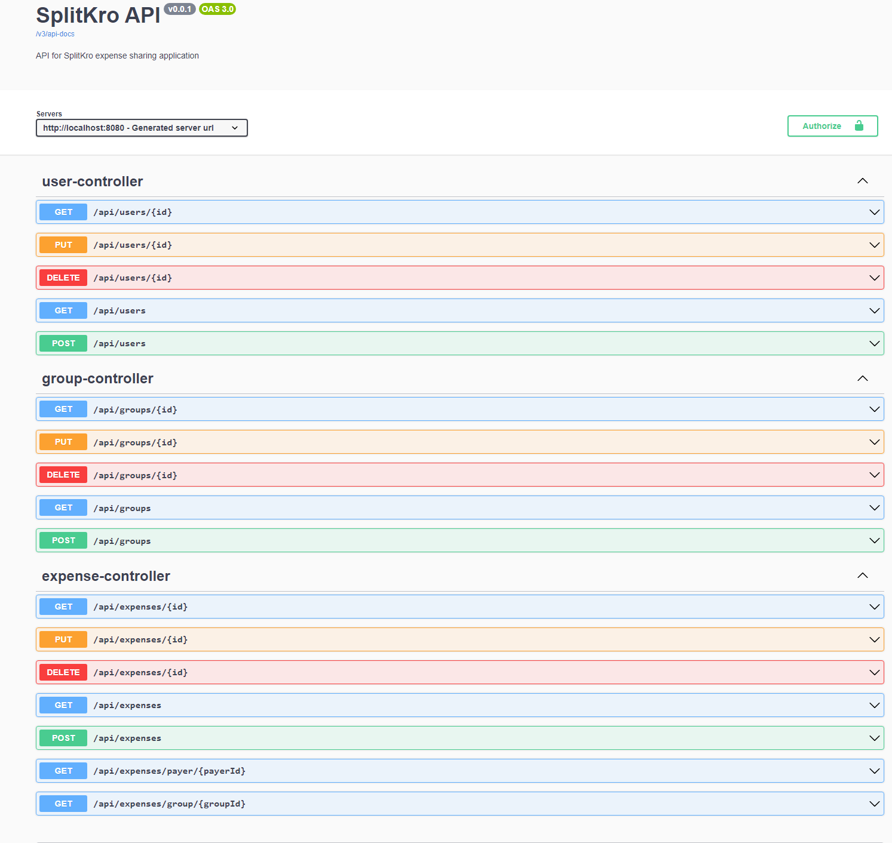
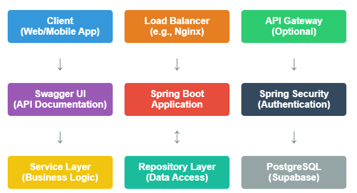
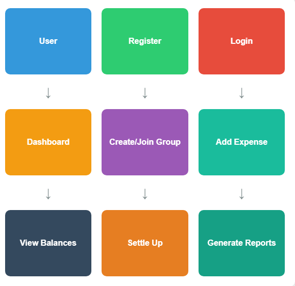

# SplitKro: Expense Sharing Application

SplitKro is a robust expense sharing application built with Spring Boot, designed to help users manage shared expenses easily and efficiently.

## Table of Contents
1. [Features](#features)
2. [Technology Stack](#technology-stack)
3. [Getting Started](#getting-started)
4. [API Documentation](#api-documentation)
5. [Database Configuration](#database-configuration)
6. [Swagger UI](#swagger-ui)
7. [Low-Level Design (LLD)](#low-level-design-lld)
8. [High-Level Design (HLD)](#high-level-design-hld)

## Requirement Gathering

| Feature | Requirements |
|---------|--------------|
| User Management | - User registration with email and password<br>- User profile creation and editing<br>- Password reset functionality<br>- User authentication and authorization<br>- User roles (e.g., regular user, group admin) |
| Group Creation and Management | - Create new groups with a name and description<br>- Add/remove members to/from groups<br>- Assign group administrators<br>- Group settings (e.g., default split method, currency)<br>- Group invitation system |
| Expense Tracking and Splitting | - Add new expenses with amount, description, and date<br>- Assign payer for each expense<br>- Specify split method (equal, exact amounts, percentages)<br>- Ability to split expenses among selected group members<br>- Categorize expenses (e.g., food, transportation, accommodation)<br>- Attach receipts or images to expenses |
| Debt Calculation | - Real-time calculation of balances within groups<br>- Individual balance calculation for each user<br>- Simplify debts to minimize transactions<br>- Support for multiple currencies<br>- Historical debt tracking |
| Reporting and Analytics | - Generate expense reports by date range, category, or group<br>- Visualize spending patterns with charts and graphs<br>- Export reports in various formats (PDF, CSV)<br>- Personal spending insights and trends |
| Settlement | - Mark debts as settled<br>- Record settlement transactions<br>- Integrate with payment gateways for direct settlements<br>- Settlement reminders and notifications |
| Notifications | - Email notifications for new expenses, settlements, and reminders<br>- In-app notifications for group activities<br>- Customizable notification preferences |

## Technology Stack
- Java 17
- Spring Boot 3.2.10
- Spring Security
- Spring Data JPA
- PostgreSQL (Supabase)
- Liquibase (for database migrations)
- Swagger (SpringDoc OpenAPI) for API documentation

## Getting Started
1. Clone the repository:
   ```
   git clone https://github.com/yourusername/splitkro.git
   ```
2. Navigate to the project directory:
   ```
   cd splitkro
   ```
3. Build the project:
   ```
   mvn clean install
   ```
4. Run the application:
   ```
   mvn spring-boot:run
   ```

## API Documentation

| Endpoint | Method | Description |
|----------|--------|-------------|
| `/api/users` | GET | Retrieve all users |
| `/api/users/{id}` | GET | Retrieve a specific user |
| `/api/users` | POST | Create a new user |
| `/api/users/{id}` | PUT | Update a user |
| `/api/users/{id}` | DELETE | Delete a user |
| `/api/groups` | GET | Retrieve all groups |
| `/api/groups/{id}` | GET | Retrieve a specific group |
| `/api/groups` | POST | Create a new group |
| `/api/groups/{id}` | PUT | Update a group |
| `/api/groups/{id}` | DELETE | Delete a group |
| `/api/expenses` | GET | Retrieve all expenses |
| `/api/expenses/{id}` | GET | Retrieve a specific expense |
| `/api/expenses` | POST | Create a new expense |
| `/api/expenses/{id}` | PUT | Update an expense |
| `/api/expenses/{id}` | DELETE | Delete an expense |

For a more detailed API documentation, please refer to the Swagger UI section below.

## Database Configuration

This application uses PostgreSQL hosted on Supabase. The database connection is configured in the `application.properties` file:

```properties
spring.datasource.url=jdbc:postgresql://aws-0-ap-south-1.pooler.supabase.com:6543/postgres
spring.datasource.username=postgres.xnghldgwregxdovykyhn
spring.datasource.password=[YOUR-PASSWORD]
```

Make sure to replace `[YOUR-PASSWORD]` with your actual Supabase database password.

## Swagger UI

Swagger UI is integrated into the application for easy API exploration and testing. Once the application is running, you can access the Swagger UI at:

```
http://localhost:8080/swagger-ui.html
```



This interface provides a comprehensive view of all available endpoints, allowing you to test the API directly from your browser.

## Low-Level Design (LLD)

The application follows a layered architecture:

1. **Controller Layer**: Handles HTTP requests and responses.
    - `UserController`: Manages user-related operations
    - `GroupController`: Handles group management
    - `ExpenseController`: Deals with expense tracking and splitting

2. **Service Layer**: Implements business logic.
    - `UserService`: User management logic
    - `GroupService`: Group operations and member management
    - `ExpenseService`: Expense creation, updating, and debt calculation
    - `DebtCalculator`: Utility for calculating debts between users

3. **Repository Layer**: Interfaces with the database.
    - `UserRepository`: Data access for User entities
    - `GroupRepository`: Data access for Group entities
    - `ExpenseRepository`: Data access for Expense entities

4. **Model Layer**: Represents database entities.
    - `User`: Represents a user in the system
    - `Group`: Represents a group of users
    - `Expense`: Represents an expense within a group

5. **DTO Layer**: Data Transfer Objects for API communication.
    - `UserDTO`: User data for API requests/responses
    - `GroupDTO`: Group data for API requests/responses
    - `ExpenseDTO`: Expense data for API requests/responses

6. **Security Configuration**: Handles authentication and authorization.
    - `SecurityConfig`: Configures Spring Security settings

7. **Swagger Configuration**: Sets up API documentation.
    - `SwaggerConfig`: Configures Swagger/OpenAPI settings

## High-Level Design (HLD)

Here's a high-level diagram of the SplitKro application architecture:



## User level Design:



This diagram illustrates the main components of the SplitKro application and how they interact with each other. The application follows a typical Spring Boot architecture with additional components like Swagger for API documentation and Spring Security for authentication.

## Data Modeling

The SplitKro application uses a relational database model to manage users, groups, expenses, and settlements. Below is a detailed explanation of each table and its relationships.

### Tables

1. **users**
   - Stores user account information
   - Fields: id, username, email, password_hash, created_at, updated_at
   - Primary Key: id
   - Unique Constraints: username, email

2. **groups**
   - Represents expense sharing groups
   - Fields: id, name, description, created_by, created_at, updated_at
   - Primary Key: id
   - Foreign Key: created_by references users(id)

3. **user_group**
   - Manages the many-to-many relationship between users and groups
   - Fields: user_id, group_id, role, joined_at
   - Primary Key: (user_id, group_id)
   - Foreign Keys:
      - user_id references users(id)
      - group_id references groups(id)

4. **expenses**
   - Records individual expenses
   - Fields: id, group_id, payer_id, amount, description, date, category_id, created_at, updated_at
   - Primary Key: id
   - Foreign Keys:
      - group_id references groups(id)
      - payer_id references users(id)
      - category_id references categories(id)

5. **expense_splits**
   - Tracks how expenses are split among users
   - Fields: id, expense_id, user_id, amount, created_at, updated_at
   - Primary Key: id
   - Foreign Keys:
      - expense_id references expenses(id)
      - user_id references users(id)

6. **settlements**
   - Records settlements between users
   - Fields: id, payer_id, payee_id, amount, group_id, settled_at, created_at, updated_at
   - Primary Key: id
   - Foreign Keys:
      - payer_id references users(id)
      - payee_id references users(id)
      - group_id references groups(id)

7. **categories**
   - Defines categories for expenses
   - Fields: id, name, created_at, updated_at
   - Primary Key: id
   - Unique Constraint: name

### Relationships

- A user can belong to multiple groups, and a group can have multiple users (Many-to-Many relationship managed through user_group table)
- An expense belongs to one group and is paid by one user (payer)
- An expense can be split among multiple users (One-to-Many relationship with expense_splits)
- A settlement involves two users (payer and payee) and is associated with a group
- Each expense can belong to one category

### Key Features

- Use of SERIAL type for auto-incrementing primary keys
- Timestamps (created_at, updated_at) for audit trails
- Proper foreign key constraints to maintain referential integrity
- Indexes on frequently queried columns for performance optimization
- Use of DECIMAL type for financial amounts to ensure precision
- Trigger-based automatic updating of 'updated_at' columns


